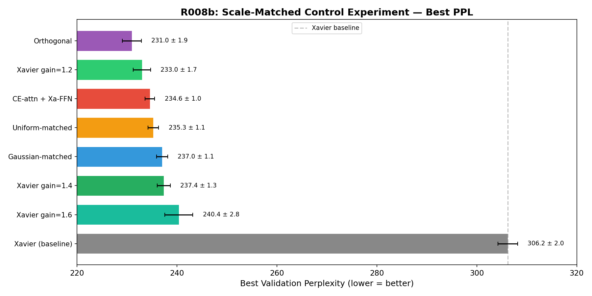
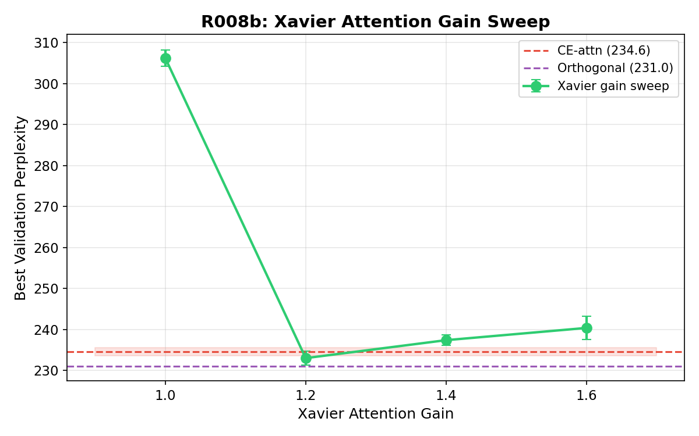
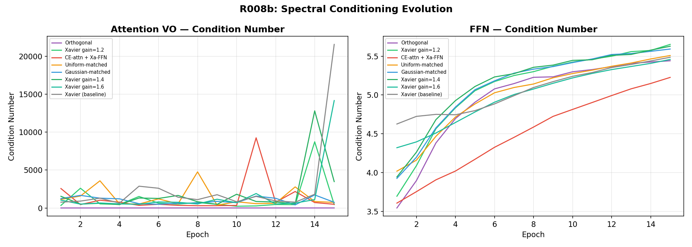
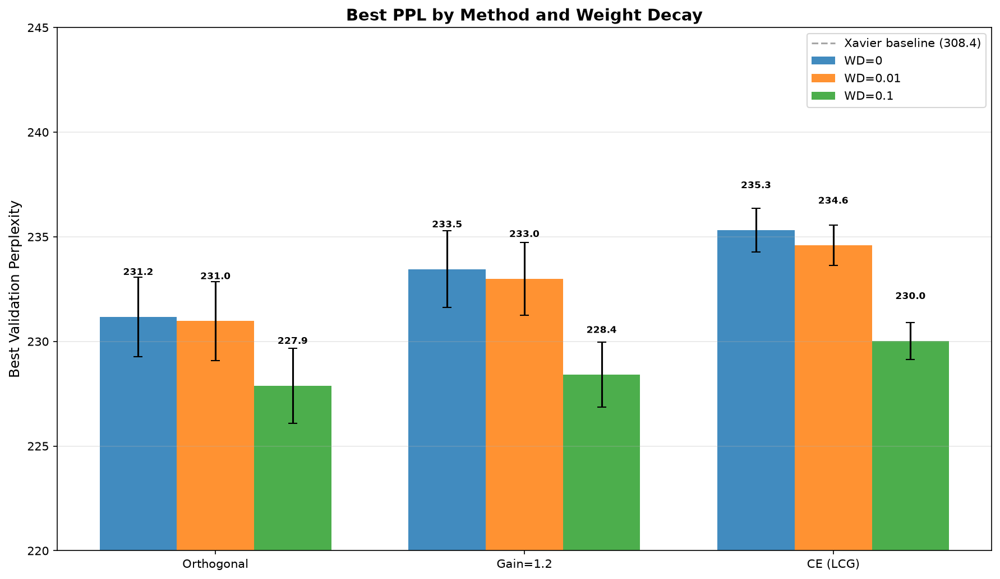
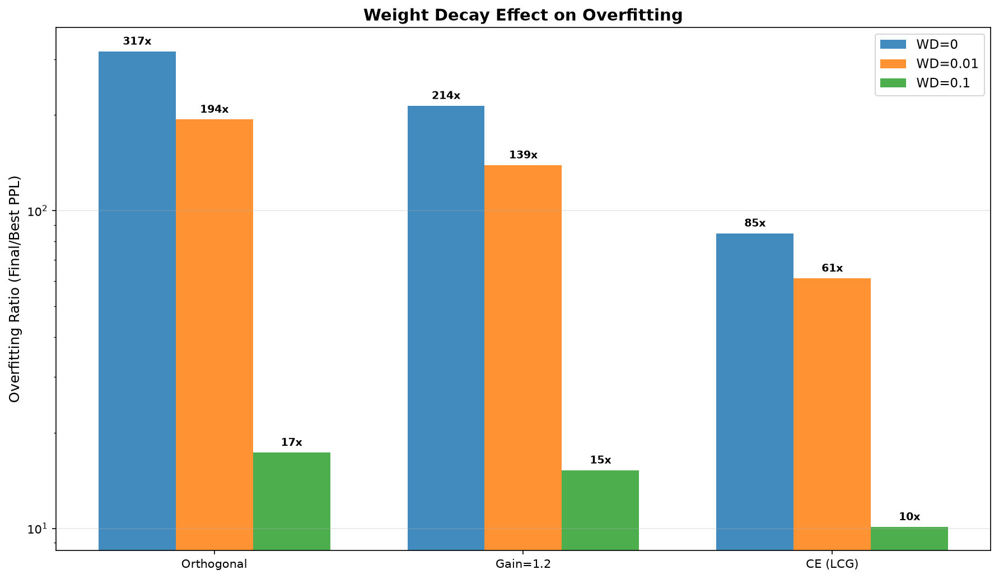
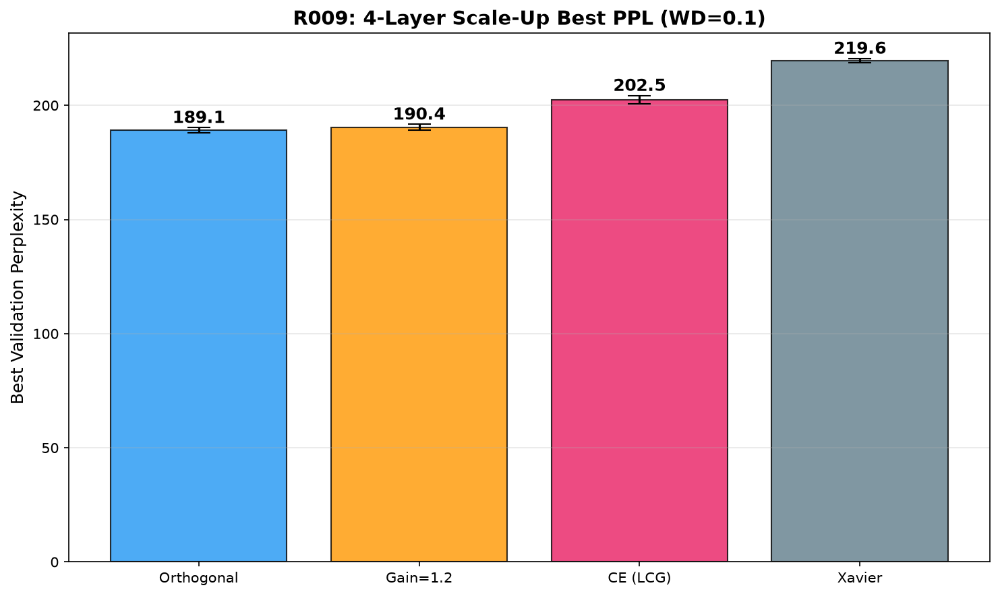
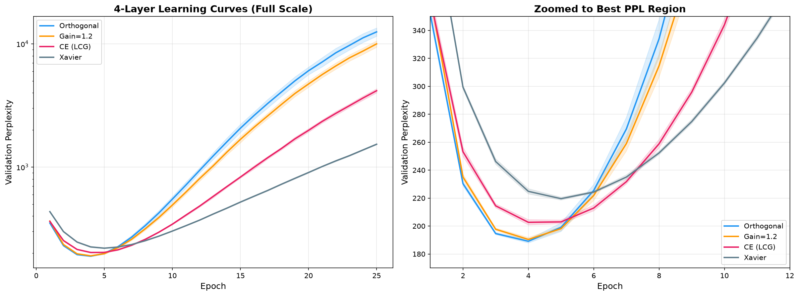
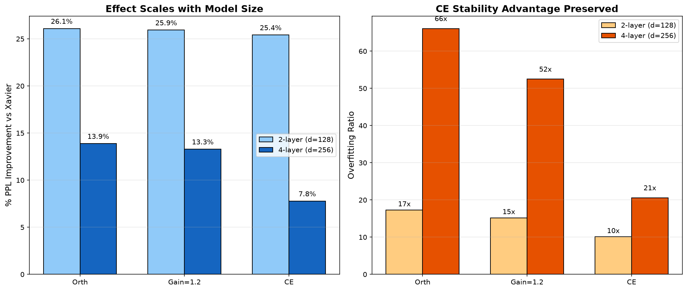

# Layer-Selective Spectral/Gain Initialization of Attention Projections

Research code and artifacts for experiments on layer-selective initialization
of Transformer attention projections (W_Q, W_K, W_V, W_O).

## Summary

The central intervention changes initialization **only** for attention projection
matrices, while keeping FFN and other components under Xavier-style initialization.
Experiments are conducted on small decoder-only Transformers trained on WikiText-2
with a GPT-2 tokenizer (vocab_size = 50 257).

## Main Finding

Layer-selective spectral/gain initialization of attention projections improves
best validation perplexity in the tested small Transformers (~25 % for 2-layer,
~14 % for 4-layer models).

The effect is **not Copeland–Erdős-specific**. Orthogonal attention initialization
and gain-tuned Xavier match or outperform CE-LCG by best PPL. CE-LCG remains
useful as a deterministic, reproducible, lower-overfit variant in long/scale-up runs.

## What Is Not Claimed

- CE-LCG is uniquely superior.
- CE-LCG is a general replacement for Xavier.
- The method is SOTA.
- The method is validated on large LLMs.
- Final perplexity always improves under long training.

## Repository Structure

```
src/copeland_erdos_nets/   — core library (CE stream, init, assignment, codebook)
tests/                     — unit tests
configs/                   — experiment configurations (JSON)
scripts/                   — reproducible experiment scripts
paper_artifacts/           — canonical tables, figures, raw data, claims ledger
docs/                      — method documentation
```

## Setup

```bash
make install      # create .venv and install editable
make check-env    # verify torch + CUDA
```

## Reproducible Experiments

### R008b — Controlled comparison (2-layer Transformer)

```bash
python scripts/run_transformer_screening.py \
  --config configs/r008b_controls.json \
  --output runs/r008b_controls
```

### R008-long — 50-epoch + weight-decay sweep

```bash
python scripts/run_transformer_screening.py \
  --config configs/r008_long_phase1.json \
  --output runs/r008_long_phase1

python scripts/run_transformer_screening.py \
  --config configs/r008_long_phase2.json \
  --output runs/r008_long_phase2
```

### R009 — 4-layer scale-up

```bash
python scripts/run_transformer_screening.py \
  --config configs/r009_scaleup.json \
  --output runs/r009_scaleup
```

## Key Results

### R008b: Controlled comparison, 2-layer Transformer (d=128, 15 epochs)

| Method | Best PPL | vs Xavier |
|---|---:|---:|
| Xavier (baseline) | 306.20 | — |
| Orthogonal-attn | 230.98 | −24.6 % |
| Xavier gain=1.2-attn | 232.99 | −23.9 % |
| CE-LCG-attn | 234.59 | −23.4 % |
| Uniform matched-attn | 235.27 | −23.2 % |
| Gaussian matched-attn | 237.02 | −22.6 % |
| Xavier gain=1.4-attn | 237.37 | −22.5 % |
| Xavier gain=1.6-attn | 240.36 | −21.5 % |



<details>
<summary><b>Gain sweep and spectral diagnostics (click to expand)</b></summary>





</details>

### R008-long: 50-epoch, WD=0.1 (2-layer)

| Method | Best PPL | Overfit Ratio |
|---|---:|---:|
| Orthogonal-attn | 227.89 | 17.3× |
| Xavier gain=1.2-attn | 228.41 | 15.2× |
| CE-LCG-attn | 230.03 | 10.1× |





### R009: 4-layer scale-up (d=256, 25 epochs, WD=0.1)

| Method | Best PPL | Overfit Ratio |
|---|---:|---:|
| Xavier (baseline) | 219.58 | 7.0× |
| Orthogonal-attn | 189.10 | 66.1× |
| Xavier gain=1.2-attn | 190.41 | 52.5× |
| CE-LCG-attn | 202.47 | 20.6× |



<details>
<summary><b>Learning curves and scale comparison (click to expand)</b></summary>





</details>

## CE-LCG Initializer

The Copeland–Erdős LCG (CE-LCG) initializer works as follows:

1. Extract *n* blocks of *m* digits from the Copeland–Erdős prime digit stream.
2. Convert to U(0,1): u = (z + 0.5) / 10^m.
3. Apply inverse normal CDF: x = Φ⁻¹(u).
4. Apply LCG assignment — a permutation over *n* tensor positions using an LCG
   over the next power-of-two modulus M ≥ n (a = 1 664 525, c = 1 013 904 223)
   with cycle walking to obtain a bijection on *n* elements.
5. Empirical standardization: x ← (x − mean) / std.
6. Scale by target σ (He or Xavier).

Matched controls are **zero-mean CE-std-matched** Gaussian/Uniform, i.e.
N(0, σ²_CE) and U(−√3·σ_CE, √3·σ_CE), not mean-matched.

## Paper Artifacts

Canonical tables, figures, raw JSON results, and a claims ledger are in
[`paper_artifacts/`](paper_artifacts/). See
[`paper_artifacts/claims_ledger.md`](paper_artifacts/claims_ledger.md) for the
full evidence-to-claim mapping and prohibited claims.

## Limitations

- Experiments limited to WikiText-2 on small decoder-only Transformers
  (2-layer: ~13.3 M total / ~463 K non-embedding; 4-layer: ~29 M total / ~3.2 M non-embedding).
- No evaluation on large LLMs or multi-domain benchmarks.
- Long-run final PPL shows significant overfitting for all non-baseline methods.

## Testing

```bash
make test    # run pytest
make lint    # ruff check
```

## Citation

If you use this code or refer to the results, please cite:

```bibtex
@misc{puzitskiy2026selective,
  title={Layer-Selective Spectral Initialization of Attention Projections
         Improves Tiny Transformer Training},
  author={Puzitskiy, Mikhail},
  year={2026},
  url={https://github.com/Mike030668/copeland-erdos-nets}
}
```

## License

MIT License — see [LICENSE](LICENSE).
