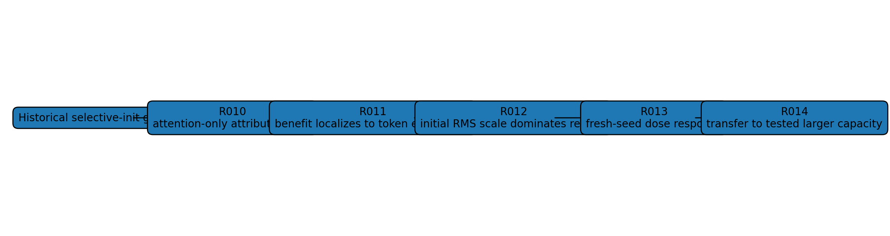
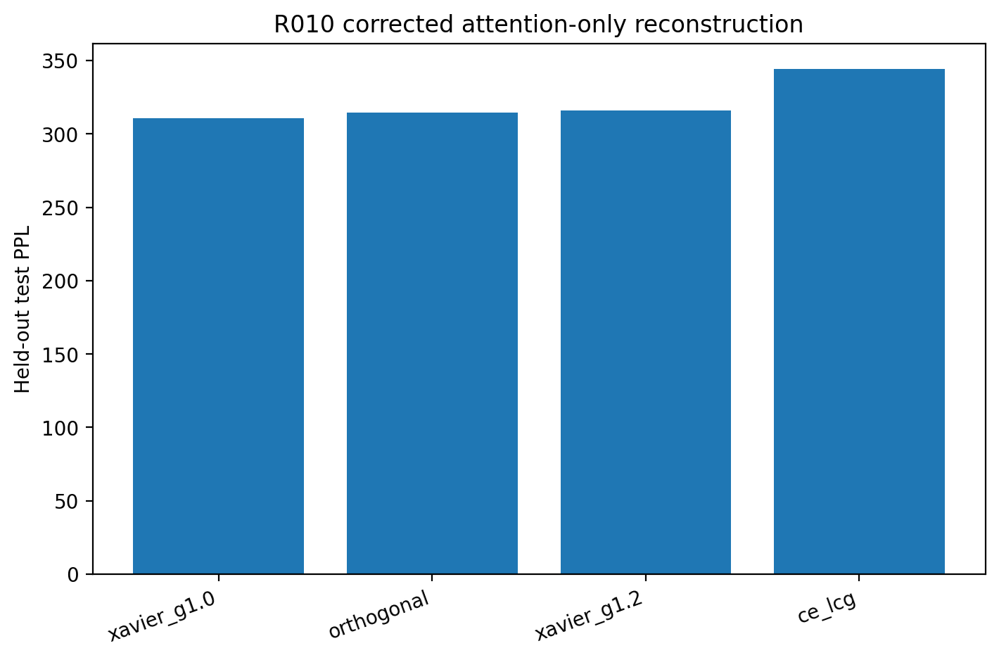
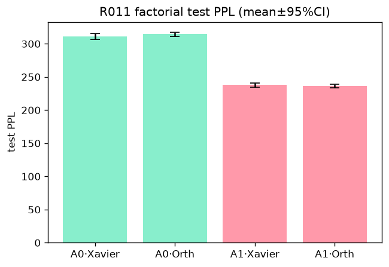
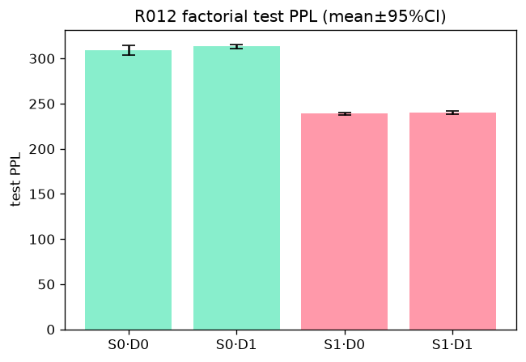
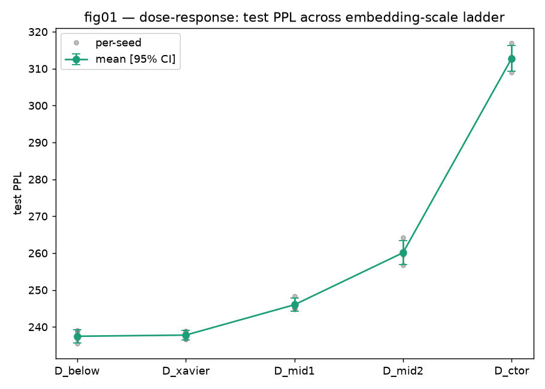
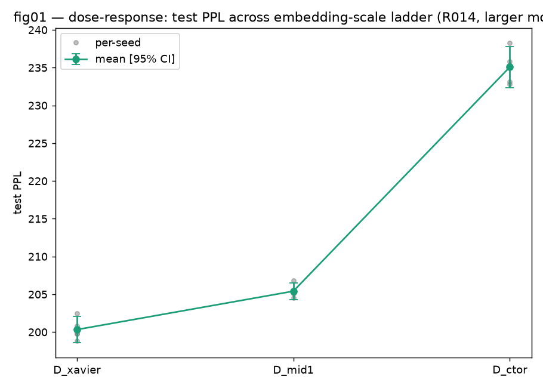
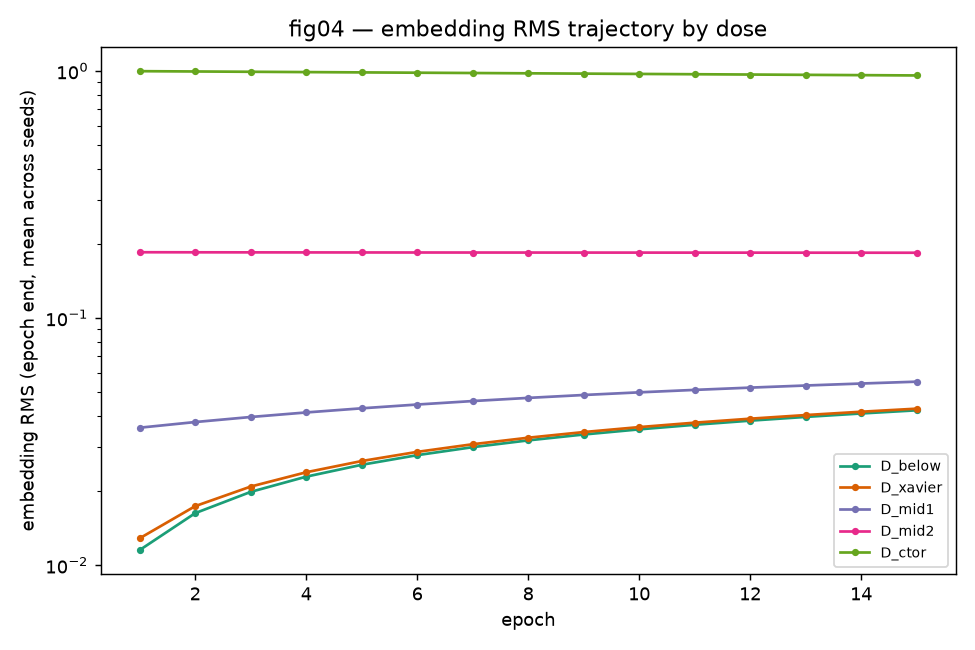
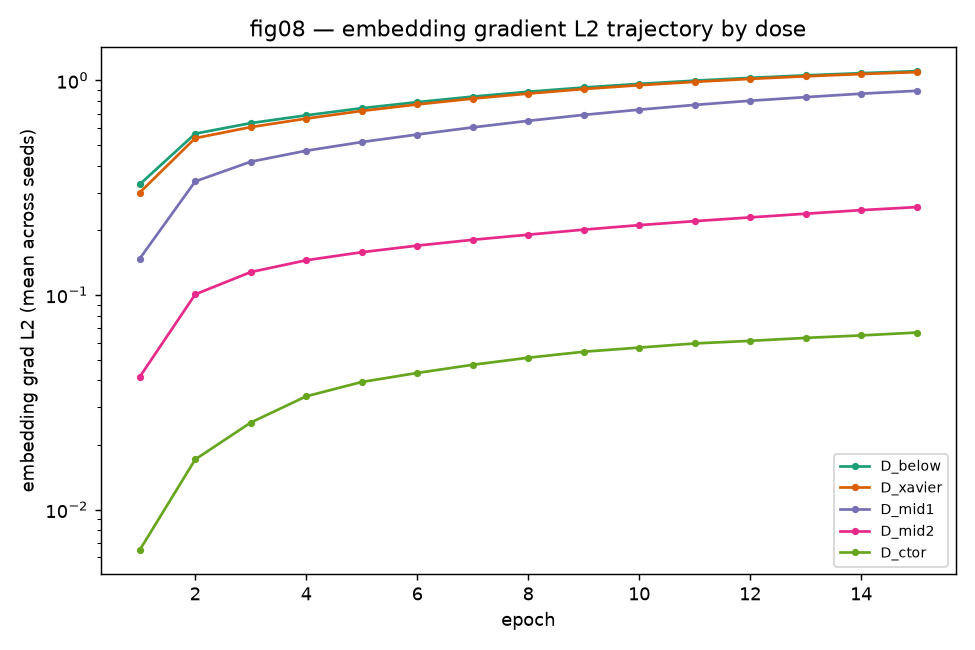
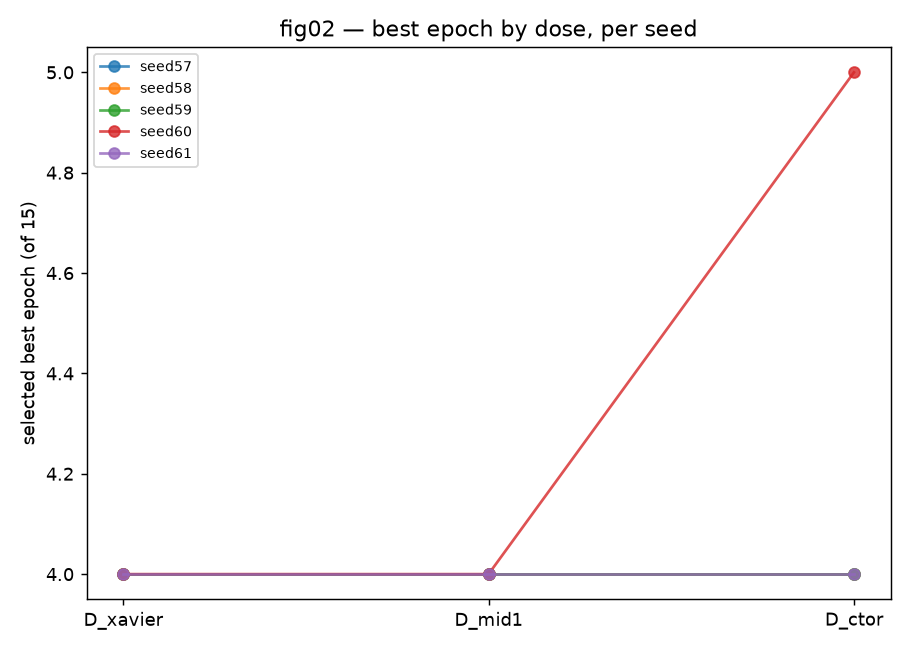
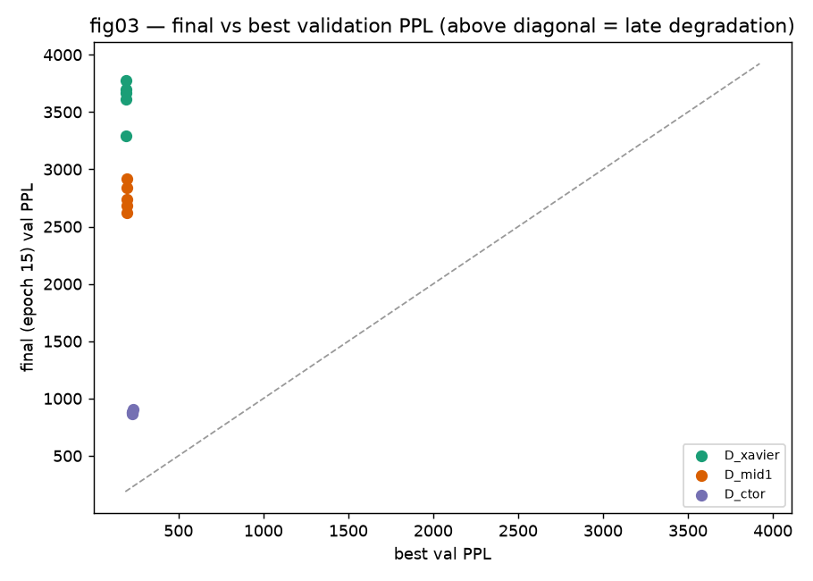

# Causal reconstruction of a selective-initialization gain in small Transformer language models: the dominant role of initial token-embedding scale

## Abstract

An earlier analysis of small Transformer language models on WikiText-2 reported a large selective-initialization gain and attributed it primarily to attention-projection initialization. We reconstruct that observation under paired protocols that control the intervention path, non-target tensors, random seeds, checkpoint selection, and the performance endpoint. The reconstruction changes the causal interpretation. An attention-only same-path experiment does not reproduce the historical gain: relative to a Xavier-gain-1.0 attention baseline, the paired held-out test-perplexity differences are +3.5210 for Orthogonal initialization (95% CI -2.4559 to +9.4979), +5.2805 for Xavier gain 1.2 (+0.3188 to +10.2421), and +33.4428 for CE-LCG (+25.4236 to +41.4619). A subsequent embedding-by-attention factorial localizes the dominant reconstructed benefit to `token_emb.weight`. A scale-by-redraw factorial then separates the initial root-mean-square (RMS) scale of the token embedding from its redraw/direction: changing the initial RMS from the constructor scale (~1) to the Xavier-scale regime (~0.0063) reduces held-out test perplexity by about 70–73 points in both redraw conditions, whereas redraw contrasts and the interaction have confidence intervals that include zero. A five-dose fresh-seed experiment reproduces the scale effect; the half-Xavier-to-Xavier contrast remains unresolved at the available precision, while every tested step above Xavier worsens mean held-out test perplexity. A final experiment transfers the scale effect to a 4-layer, `d_model=256` model on the same corpus. These results support a bounded conclusion: in the tested decoder-only Transformer implementation and training regime, initial token-embedding RMS scale is the dominant reconstructed control variable behind the historical gain. They do not establish a downstream mechanism, a universal lower-scale rule, cross-corpus transfer, or large-model generality.

## 1. Introduction

Parameter initialization sets the scale and geometry of the signals with which optimization begins. In Transformers, initialization has been studied together with normalization placement, residual scaling, attention conditioning, and parameterization [1–9,18–21]. Attention-specific initialization is a particularly relevant line of prior work: Mimetic Initialization changes self-attention initialization [10], while later work has examined spectral conditioning and conditioned attention initialization [11,12]. The present study originated in that context.

A historical version of this project reported a large selective-initialization improvement in small decoder-only Transformers on WikiText-2 and interpreted it through an attention-projection spectral/gain narrative. An implementation and reproducibility audit subsequently showed that the historical comparison did not isolate the attention-only intervention cleanly. In particular, the token-embedding path had to be separated from the attention initialization path under matched execution and parameter parity. The purpose of this paper is to reconstruct that observation rather than to preserve its original attribution.

The reconstruction proceeds as a sequence of paired tests. First, an attention-only same-path experiment asks whether changing Q/K/V/O initialization alone reproduces the historical improvement. It does not. Second, a crossed embedding-by-attention experiment localizes the dominant reconstructed difference to the token-embedding condition. Third, a scale-by-redraw factorial separates the initial RMS scale of the embedding tensor from redraw/direction. Fourth, a fresh-seed dose ladder characterizes the response over five initial embedding scales. Fifth, the scale intervention is repeated in a larger, but still small, 4-layer `d_model=256` model. Training-dynamics telemetry is used only descriptively; it is not treated as a mechanism test.

The main result is therefore narrower than the original narrative. It is not that attention-projection initialization is generally ineffective, nor that a particular deterministic or orthogonal initializer is superior. Rather, under the tested implementation, dataset, model families, and fixed training regime, the historical selective-initialization gain is reconstructed primarily through initial token-embedding RMS scale. The study also documents the negative attention-only result that forced that reinterpretation instead of omitting it.

## 2. Related Work

### 2.1 Transformer initialization and training stability

Transformer optimization is sensitive to normalization placement, residual scaling, initialization, and parameterization. Xiong et al. analyzed LayerNorm placement at initialization [2]; Liu et al. studied residual-branch amplification and proposed Admin [3]; DeepNet/DeepNorm addressed scaling to very deep Transformers [4]; and NormFormer added normalization and head-wise scaling to Pre-LN Transformers [5]. Fixup [18], T-Fixup [19], ReZero [20], and maximal-update parameterization (μP) [21] provide broader examples in which initialization or parameterization is used to control signal propagation and optimization. These methods motivate scale-sensitive analyses but do not establish the token-embedding result reported here.

### 2.2 Attention-specific initialization and conditioning

Mimetic Initialization directly modifies self-attention initialization [10]. Saratchandran and Lucey subsequently studied spectral conditioning of attention [11] and conditioned initialization for attention [12]. Their work is direct prior work for the historical framing of this project. The corrected attention-only experiment in this paper does **not** refute those methods generally; it narrows this project's earlier attention-only attribution under a specific decoder-only language-model protocol. No Mimetic or Conditioned Initialization baseline was run here, so no empirical comparison to those methods is claimed.

### 2.3 Embedding scale and adjacent scale-sensitive work

Herold et al. studied weight-norm initialization and regularization in neural language models [14]. Nguyen and Salazar reported that initialization and normalization scale choices affect Transformer training [9]. Zhang et al. showed that initialization scale can affect whether Transformers learn particular compositional tasks by reasoning or memorization [15]. Kedia et al. developed an end-to-end signal-propagation account for language-model stability [16], and Nishida et al. studied reparameterization-based initialization intended to reduce loss spikes in large language models [17]. Conditioned embedded-token work is also adjacent [13]. These studies motivate attention to initialization scale, but the present experiments test a more specific quantity: the initial RMS of `token_emb.weight` in one decoder-only implementation.

The literature review is used to position the result, not to infer novelty from search absence.

## 3. Historical observation and discovered confound

**LEGACY / CONFOUNDED DISCOVERY EVIDENCE.** In the historical R008b-style comparison, the Xavier baseline reached a best validation perplexity of approximately 306.20, while Orthogonal attention initialization reached 230.98, Xavier gain 1.2 reached 232.99, and CE-LCG attention initialization reached 234.59. These are **best validation PPL** values from the legacy discovery protocol. They are **not directly comparable** with the R010–R014 held-out test PPL values reported below and are **not causal effect estimates**.

Those historical differences motivated an attention-centered explanation. The subsequent implementation/reproducibility audit showed, however, that the legacy protocol did not isolate the attention-only intervention sufficiently to sustain that attribution. The central reconstruction target was therefore not “which attention initializer is best?” but “which controlled factor reproduces the historical gap when execution path, parameter state, seed matching, checkpoint selection, and the evaluation endpoint are fixed?”

This correction is scientifically material. The historical observation remains part of the record, but the causal interpretation is allowed to change when a better-controlled experiment contradicts the original attribution.

## 4. Corrected paired methodology

### 4.1 Data, tokenization, and sequence construction

All corrected cycles use the Hugging Face dataset namespace `Salesforce/wikitext`, configuration `wikitext-2-raw-v1`, derived from the WikiText corpus [22]. Tokenization uses the GPT-2 tokenizer/model vocabulary [23]. The sequence length is 128 tokens and the batch size is 32.

The raw train, validation, and test splits are kept distinct. Text is tokenized with the GPT-2 tokenizer and the resulting token-id lists are flattened within each split. Sequences are constructed as contiguous blocks of `seq_len + 1` tokens, with the first 128 positions used as input and the one-token-shifted positions used as next-token targets. The canonical data policy drops incomplete final batches for training and validation; the held-out test split is retained for final evaluation of the validation-selected checkpoint. Training batches are shuffled, whereas validation and test evaluation are deterministic under the cycle parity contracts.

Validation and test therefore serve different purposes. Validation PPL selects the checkpoint within each seed-condition run. Held-out test PPL is evaluated only at that selected checkpoint and is the primary endpoint for R010–R014. Legacy R008/R009 best-validation PPL is not pooled with, or subtracted from, the corrected test endpoint.

### 4.2 Model families

R010–R013 use the same small decoder-only Transformer family: `d_model=128`, `d_ff=512`, `n_heads=4`, and `n_layers=2`. R014 increases capacity to `d_model=256`, `d_ff=1024`, `n_heads=4`, and `n_layers=4`, with effective vocabulary size 50,257.

The architecture uses learned token and positional embeddings. For a token-index matrix `idx`, the input to the Transformer blocks is

\[
X_0 = E_{\mathrm{tok}}(\mathrm{idx}) + E_{\mathrm{pos}}[:, :T, :],
\tag{1}
\]

with no `sqrt(d_model)` multiplier applied to the token-embedding output. The final language-model head is a separate `Linear(d_model, vocab_size)` module; its weights are not tied to `token_emb.weight`. These details matter because an embedding scale that is effective in this architecture need not transfer to architectures that rescale, normalize, or tie embeddings differently.

### 4.3 Training protocol and seed blocks

Every corrected cycle uses 15 training epochs, AdamW [24], learning rate `5 × 10^-4`, and weight decay `0.01`. The canonical seed blocks are: R010, 42–46; R011, 42–46; R012, 47–51; R013, 52–56; and R014, 57–61. The reuse of 42–46 in R010 and R011 is intentional for the reconstruction sequence; the later cycles use fresh seed blocks.

Non-target tensors are held fixed according to each cycle's parity contract. Depending on the cycle, the parity artifacts include base-state hashes, unchanged-parameter hashes, attention-parity checks, batch-order or epoch-batch hashes, checkpoint manifests, and source/runtime manifests. The purpose is to ensure that a reported paired contrast corresponds to the specified factor rather than an unintended state or data-order difference.

### 4.4 Embedding-scale intervention

Let `base = token_emb.weight` for the parity-matched base model. Define tensor RMS as

\[
\operatorname{RMS}(E)=\sqrt{\frac{1}{N}\sum_{j=1}^{N}E_j^2}.
\tag{2}
\]

For scale-only conditions,

\[
s_0=\operatorname{RMS}(\mathrm{base}), \qquad
u_0=\frac{\mathrm{base}}{s_0},
\tag{3}
\]

and the scaled embedding is

\[
E(s)=s\,u_0.
\tag{4}
\]

Thus the scale-only intervention preserves the base embedding direction exactly and changes only its RMS. Redraw conditions use the cycle's separately defined redraw/direction factor while matching the requested scale. The constructor-scale embeddings have RMS close to 1, whereas the Xavier-scale target is approximately 0.0063. The constructor-to-Xavier RMS ratio is therefore about 159× in both R013 and R014. This magnitude is descriptive; it is not itself evidence for a downstream mechanism.

R013 uses target RMS values 0.00315017 (`D_below`), 0.00630035 (`D_xavier`), 0.03411213 (`D_mid1`), 0.18469427 (`D_mid2`), and 0.99999524 (`D_ctor`). R014 uses 0.00629236 (`D_xavier`), 0.03408242 (`D_mid1`), and 0.99991812 (`D_ctor`). The exact factors relative to the constructor are reported with the result tables.

### 4.5 Paired estimands and confidence intervals

All corrected contrasts are seed-matched. If `PPL_A,i` and `PPL_B,i` denote held-out test PPL for conditions A and B under seed `i`, the paired seed-level difference is

\[
\Delta_i = \mathrm{PPL}_{A,i}-\mathrm{PPL}_{B,i}.
\tag{5}
\]

For five seeds,

\[
\bar{\Delta}=\frac{1}{5}\sum_{i=1}^{5}\Delta_i,
\tag{6}
\]

and the reported 95% paired confidence interval is the Student-t interval

\[
\bar{\Delta}\;\pm\;t_{0.975,4}\frac{s_{\Delta}}{\sqrt{5}},
\qquad t_{0.975,4}=2.776,
\tag{7}
\]

where `s_Δ` is the sample standard deviation of the five paired seed differences. The value 2.776 reproduces the rounded critical value used in the canonical summary artifacts. No independent-sample interval is substituted for this paired estimand.

### 4.6 Experiment map

**Table 1. Corrected experiment-design map.**

| Experiment | Scientific question | Factor / intervention | Seed block | Primary endpoint |
|---|---|---|---|---|
| R010 | Does the historical gain survive an attention-only same-path intervention? | Q/K/V/O attention initialization; non-target tensors parity-matched | 42–46 | Held-out test PPL at the validation-selected checkpoint |
| R011 | Which historical parameter group carries the reconstructed benefit? | Token-embedding condition × attention condition factorial | 42–46 | Held-out test PPL at the validation-selected checkpoint |
| R012 | Is the embedding effect attributable to initial RMS scale or redraw/direction? | Embedding RMS scale × redraw/direction factorial | 47–51 | Held-out test PPL at the validation-selected checkpoint |
| R013 | How does held-out performance vary over a fresh-seed embedding-scale ladder? | Five target RMS doses | 52–56 | Held-out test PPL at the validation-selected checkpoint |
| R014 | Does the tested scale effect persist at a larger model capacity? | Three target RMS doses in a 4-layer, d_model=256 model | 57–61 | Held-out test PPL at the validation-selected checkpoint |

## 5. R010 attention-only reconstruction

R010 asks whether the historical gain survives when only attention Q/K/V/O initialization is changed under the same execution path while non-target state is parity-matched. CE-LCG appears here as one of the corrected controls; no causal or superiority status is assigned to it.

**Table 2. R010 corrected attention-only reconstruction.**

| Method | Mean held-out test PPL | Paired Δ vs xavier_g1.0 | 95% CI |
|---|---|---|---|
| xavier_g1.0 | 310.7671 | reference | — |
| orthogonal | 314.2882 | +3.5210 | [-2.4559, +9.4979] |
| xavier_g1.2 | 316.0476 | +5.2805 | [+0.3188, +10.2421] |
| ce_lcg | 344.2099 | +33.4428 | [+25.4236, +41.4619] |

The corrected baseline mean is 310.7671 held-out test PPL. Orthogonal attention initialization differs from that baseline by +3.5210 PPL, with a 95% CI spanning zero. Xavier gain 1.2 is +5.2805 PPL and its 95% CI is entirely positive. CE-LCG is +33.4428 PPL, also entirely positive. None reproduces the large historical improvement. This is the supported negative result that changes the manuscript's direction; it does not imply that attention-specific initialization methods outside this experiment are ineffective.

## 6. R011 embedding localization

R011 crosses the token-embedding condition with the attention condition. `A0` denotes the constructor-scale token-embedding path and `A1` the historical-Xavier token-embedding path; `B0` and `B1` denote the baseline and altered attention conditions used in the accepted factorial. The purpose is localization: if the historical-scale embedding reproduces the benefit across attention conditions while the attention contrast remains small or unresolved, the dominant reconstructed difference lies in the embedding path.

**Table 3. R011 embedding × attention factorial.**

| Cell / contrast | Condition or estimate | Held-out test PPL / CI |
|---|---|---|
| A0B0 | constructor / xavier_g1.0 | 310.7659 |
| A0B1 | constructor / orthogonal | 314.2870 |
| A1B0 | historical_xavier / xavier_g1.0 | 237.6904 |
| A1B1 | historical_xavier / orthogonal | 235.9598 |
| Contrast | Estimate | 95% CI |
| E_B0 | -73.0755 | [-77.9370, -68.2140] |
| E_B1 | -78.3272 | [-82.3162, -74.3382] |
| B_A0 | +3.5210 | [-2.4558, +9.4978] |
| B_A1 | -1.7306 | [-6.6887, +3.2275] |
| I | -5.2516 | [-12.0463, +1.5430] |

Both embedding contrasts are large and negative: -73.0755 PPL in `B0` and -78.3272 PPL in `B1`, with both paired 95% intervals excluding zero. By contrast, the attention contrast is +3.5210 PPL under `A0` and -1.7306 under `A1`; both corresponding intervals include zero. The interaction estimate, -5.2516, also has an interval spanning zero. These results localize the dominant reconstructed benefit to the token-embedding condition within R011, without establishing token-embedding reinitialization as the unique historical cause.

A provenance limitation specific to R011 is retained. The accepted seed-atomic v2 cycle used a global runtime that differed from the frozen smoke runtime. The deviation was common to all accepted R011 cells and therefore does not define a factorial factor, but exact historical source-bundle provenance was incomplete. R011 is used for within-R011 paired factorial inference; absolute cross-cycle values are not treated as an exact same-runtime replication.

## 7. R012 scale-vs-redraw decomposition

R012 separates the two properties that R011 leaves entangled: initial embedding RMS scale and redraw/direction. The four cells cross constructor versus Xavier-scale RMS with original versus redrawn direction.

**Table 4. R012 scale × redraw decomposition.**

| Cell / contrast | Mean held-out test PPL / estimate | 95% CI |
|---|---|---|
| S0D0 | 309.3113 | — |
| S0D1 | 313.2945 | — |
| S1D0 | 238.8156 | — |
| S1D1 | 239.8619 | — |
| scale_D0 | -70.4957 | [-76.0670, -64.9244] |
| scale_D1 | -73.4326 | [-76.7123, -70.1529] |
| redraw_S0 | +3.9832 | [-1.5566, +9.5231] |
| redraw_S1 | +1.0464 | [-1.6432, +3.7359] |
| interaction | -2.9369 | [-9.8664, +3.9927] |

Changing from constructor to Xavier-scale RMS reduces held-out test PPL by -70.4957 under `D0` and -73.4326 under `D1`; both confidence intervals exclude zero. The redraw effects are +3.9832 and +1.0464 PPL, with intervals spanning zero, and the interaction estimate is -2.9369 with an interval spanning zero. Within this tested two-level factorial, initial RMS scale therefore accounts for the dominant contrast, while a redraw/direction effect and a scale-by-redraw interaction are not resolved.

This decomposition does not identify a downstream mechanism and does not establish an optimal scale. It only separates scale from direction under the factors that were actually tested.

## 8. R013 dose response

R013 uses a fresh seed block, 52–56, and a five-dose RMS ladder. It therefore addresses two questions: whether the scale effect reproduces away from the R012 seeds, and how held-out test PPL changes over the tested scale range.

**Table 5. R013 five-dose embedding-scale response.**

| Dose | Target RMS | Factor vs constructor | Mean held-out test PPL | 95% CI |
|---|---|---|---|---|
| D_below | 0.00315017 | 0.00315019 | 237.4669 | [235.6755, 239.2584] |
| D_xavier | 0.00630035 | 0.00630038 | 237.7808 | [236.4715, 239.0902] |
| D_mid1 | 0.03411213 | 0.03411230 | 246.0022 | [244.2088, 247.7956] |
| D_mid2 | 0.18469427 | 0.18469514 | 260.1027 | [256.8340, 263.3713] |
| D_ctor | 0.99999524 | 1.00000000 | 312.7575 | [309.2299, 316.2851] |

| Paired contrast | Mean Δ test PPL | 95% CI | CI excludes zero |
|---|---|---|---|
| D_below_minus_D_xavier | -0.3139 | [-1.0963, +0.4685] | false |
| D_xavier_minus_D_mid1 | -8.2214 | [-10.2740, -6.1687] | true |
| D_mid1_minus_D_mid2 | -14.1005 | [-18.0285, -10.1725] | true |
| D_mid2_minus_D_ctor | -52.6548 | [-53.4602, -51.8494] | true |
| D_xavier_minus_D_ctor | -74.9767 | [-79.2949, -70.6584] | true |

The half-Xavier-to-Xavier contrast is -0.3139 PPL with 95% CI [-1.0963, +0.4685]. It remains unresolved at the available precision and is not interpreted as equality. All tested steps above Xavier worsen: `D_xavier-D_mid1=-8.2214`, `D_mid1-D_mid2=-14.1005`, and `D_mid2-D_ctor=-52.6548`, with all three confidence intervals excluding zero. The broader `D_xavier-D_ctor` contrast is -74.9767 PPL, again with an interval excluding zero and all five seed-level differences negative.

R013 reproduces the effect on fresh seeds, reducing concern that the result is specific to the original seed block. The result supports a low-scale region in which the half-Xavier versus Xavier ordering is unresolved at the present precision, followed by monotonic worsening across the tested doses above Xavier. It does not support the universal statement that lowering embedding scale always improves a Transformer.

## 9. R014 capacity transfer

R014 repeats the scale intervention in a 4-layer, `d_model=256`, `d_ff=1024`, 4-head model using seeds 57–61. The tested ladder contains `D_xavier`, `D_mid1`, and `D_ctor`; it does not include `D_below` and therefore cannot test transfer of the unresolved below-Xavier region.

**Table 6. R014 larger-capacity scale intervention.**

| Dose | Target RMS | Factor vs constructor | Mean held-out test PPL | 95% CI |
|---|---|---|---|---|
| D_xavier | 0.00629236 | 0.00629287 | 200.3252 | [198.5897, 202.0608] |
| D_mid1 | 0.03408242 | 0.03408521 | 205.4083 | [204.3242, 206.4924] |
| D_ctor | 0.99991812 | 1.00000000 | 235.0694 | [232.3218, 237.8171] |

| Paired contrast | Mean Δ test PPL | 95% CI | CI excludes zero |
|---|---|---|---|
| D_xavier_minus_D_ctor | -34.7442 | [-37.5676, -31.9208] | true |
| D_xavier_minus_D_mid1 | -5.0831 | [-7.2794, -2.8868] | true |
| D_mid1_minus_D_ctor | -29.6611 | [-33.3032, -26.0191] | true |

The primary `D_xavier-D_ctor` paired contrast is -34.7442 PPL (95% CI -37.5676 to -31.9208). All five seed-level primary contrasts are negative. The secondary `D_xavier-D_mid1` contrast is -5.0831 PPL (-7.2794 to -2.8868), and `D_mid1-D_ctor` is -29.6611 (-33.3032 to -26.0191). At every tested seed, the held-out ordering is `D_xavier < D_mid1 < D_ctor`.

The scale effect therefore persists at this tested larger capacity on WikiText-2. The smaller absolute `D_xavier-D_ctor` PPL gap relative to R013 is not converted into a capacity-scaling law. Nor does R014 provide evidence about the below-Xavier region, because that condition was not run.

## 10. Training-dynamics diagnostics

The corrected cycles include training-dynamics measurements that are useful for characterizing when the scale-dependent performance differences emerge. These observations are diagnostic only.

R013 includes token-embedding RMS trajectories and token-embedding gradient-L2 trajectories. These show how the intervened tensor scale and its gradients evolve during the five-dose experiment.

R014 records checkpoint timing and validation degradation diagnostics, including best epoch and final-versus-best validation PPL. It did **not** collect the embedding RMS/gradient telemetry shown for R013, and those measurements are not imputed to R014.

The diagnostics are consistent with scale-dependent optimization trajectories, but they do not distinguish among candidate explanations such as representation-scale geometry, effective learning-rate or relative-update effects, residual-stream scale, or gradient geometry. No one of these is claimed as the mechanism.

## 11. Discussion

The reconstruction changes the scientific interpretation of the historical selective-initialization result. Under the corrected R010 same-path protocol, changing attention Q/K/V/O initialization alone does not reproduce the earlier large gain. R011 then localizes the dominant reconstructed difference to the token-embedding path, and R012 shows that initial RMS scale, rather than redraw/direction, dominates the tested factorial. R013 reproduces the effect on fresh seeds and quantifies the response over five scale doses; R014 repeats the effect at a second, larger tested capacity.

A conspicuous implementation detail is the scale gap itself. In these experiments, the constructor-scale token embedding has RMS approximately 1, while the Xavier-scale target is approximately 0.0063, a ratio of about 159×. At model input, token embeddings are added directly to learned positional embeddings without a `sqrt(d_model)` multiplier, and the output `lm_head` is separate from, and untied to, the input embedding matrix. Consequently, the numerical scale regime studied here is architecture-specific. Models that initialize token embeddings differently, multiply embedding outputs by a dimension-dependent factor, normalize embeddings before the first block, or tie input and output embeddings may respond differently.

The strongest general methodological implication is therefore a control requirement rather than a universal prescription: when attributing an initialization gain to a Transformer submodule, token-embedding RMS and the exact execution path should be checked explicitly. This conclusion is compatible with, rather than a refutation of, attention-specific initialization research [10–12]. Those methods were not run as baselines here.

The dose-response evidence also requires careful wording. R013 does not prove a flat optimum below Xavier; it leaves the half-Xavier-to-Xavier comparison unresolved at n=5 and the present variance. Conversely, the monotonic worsening above Xavier applies only to the doses tested in R013. R014 establishes persistence of the Xavier-versus-larger-scale ordering at one larger capacity, not a continuous scaling law across model size.

## 12. Limitations

The study uses WikiText-2 only; there is no second corpus, so cross-corpus transfer is untested. Each corrected cycle contains five paired seeds. This supports the reported paired intervals but limits population-level generalization.

Only two model capacities are represented: the 2-layer `d_model=128` family used for R010–R013 and the 4-layer `d_model=256` family used for R014. No large-language-model experiment is included.

The optimizer and training schedule are fixed: AdamW, learning rate `5 × 10^-4`, weight decay `0.01`, and 15 epochs. There is no scale×learning-rate factorial, optimizer comparison, scheduler sweep, dropout sweep, clipping sweep, or dedicated training-horizon study. A scale intervention can alter effective update ratios, but the present experiments do not separate that possibility from other downstream explanations.

Mimetic Initialization [10] and Conditioned Initialization [12] are direct related work but were not run as empirical baselines. No superiority claim against them is made.

The downstream mechanism remains unresolved. R013 embedding RMS and gradient trajectories and R014 checkpoint/validation diagnostics establish associations with the manipulated scale but do not identify why held-out test PPL changes.

The implementation boundary is also material. The studied architecture uses direct `token_emb + pos_emb`, no `sqrt(d_model)` embedding-output multiplier, and an untied output head. Generalization to architectures with different embedding initialization, embedding-output scaling, embedding normalization, or tied input/output embeddings is untested.

Finally, R011 has a specific provenance limitation. Its accepted seed-atomic v2 run used a global runtime different from the frozen smoke runtime; the deviation was common to all accepted factorial cells and is therefore non-factorial, but exact historical source-bundle provenance was incomplete. R011 is used for within-cycle paired factorial inference rather than as an exact same-runtime absolute replication of other cycles.

R012 retains two additional provenance limitations. First, a full all-parameter `base_state` hash was not retained. The accepted within-R012 factorial inference instead rests on the retained base embedding hash, explicit non-embedding invariance hashes, exact factor construction, attention parity, all-epoch batch parity, and checkpoint evidence. Second, a unique provider-level physical Colab VM/session identifier was not retained for every canonical attempt; the seed-atomic execution lineage is therefore operational rather than an immutable provider-level VM identity. These limitations concern reproducibility/provenance. They do not invalidate the accepted within-R012 factorial inference and do not change the conclusion that initial embedding RMS scale dominates redraw/direction in the tested R012 design.

## 13. Reproducibility

The corrected result tables are generated from machine-readable canonical CSV artifacts rather than transcribed manually. A companion generator checks the manuscript values against the accepted summaries and seed-level rows; any mismatch is configured to fail closed before a table is emitted. The five-seed paired confidence intervals reproduce the canonical Student-t procedure described in Eq. (7).

For each corrected cycle, reproducibility materials include the resolved configuration and the applicable state/parity/checkpoint manifests. R010 provides same-path attention intervention metrics and parameter/data-order parity artifacts. R011 retains the provenance limitation described above. R012 provides factor-construction, embedding-scale/direction, parity, and factorial-summary artifacts, while retaining the two provenance limitations stated in Section 12: no full all-parameter `base_state` hash and no immutable provider-level physical Colab VM/session identifier for every canonical attempt. The retained R012 causal controls comprise the base embedding hash, explicit non-embedding invariance hashes, exact factor construction, attention parity, all-epoch batch parity, and checkpoint evidence. R013 and R014 provide scale ladders, paired-contrast files, checkpoint and source/runtime materials, together with their documented diagnostic outputs.

**Table 7. Reproducibility and provenance envelope.**

| Cycle | Main reproducibility controls | Retained boundary |
|---|---|---|
| R010 | Same-path intervention; base/changed/unchanged parameter hashes; batch-order and checkpoint records | Applies to corrected attention-only cycle |
| R011 | Seed-atomic factorial rows and paired factorial summaries | Global runtime differs from frozen smoke runtime; historical source-bundle provenance incomplete |
| R012 | Base embedding hash; explicit non-embedding invariance hashes; exact factor construction; scale/direction hashes and statistics; attention parity; all-epoch batch parity; checkpoints | Full all-parameter `base_state` hash not retained; unique provider-level physical Colab VM/session ID not retained for every canonical attempt; seed-atomic lineage is operational rather than immutable provider-level identity. These provenance limits do not alter the accepted within-cycle factorial inference. |
| R013 | Fresh seed block; exact RMS ladder; paired contrasts; checkpoints; source/runtime manifests; embedding dynamics | Below-Xavier versus Xavier unresolved at current precision |
| R014 | Larger-capacity resolved config; exact RMS ladder; paired contrasts; checkpoints; source/runtime manifests | Below-Xavier condition not tested; no embedding RMS/gradient telemetry |

The machine-facing paths, hashes, internal evidence classifications, and exact figure lineage are kept in companion audit artifacts rather than in journal-facing prose.

## 14. Conclusion

A controlled reconstruction of a historical selective-initialization gain in small Transformer language models changes its attribution. The historical attention-only explanation does not survive a corrected same-path attention intervention. The dominant reconstructed difference localizes to `token_emb.weight`, and a crossed factorial identifies initial token-embedding RMS scale as the dominant tested factor over redraw/direction. A fresh-seed five-dose experiment reproduces the effect and leaves the half-Xavier-to-Xavier comparison unresolved while showing monotonic worsening over the tested doses above Xavier. The same scale ordering persists in a 4-layer `d_model=256` model on WikiText-2.

The conclusion is deliberately bounded. The experiments do not establish a downstream mechanism, a universal lower-scale-is-better rule, cross-corpus transfer, large-language-model transfer, or superiority of a named attention initializer. They show that, in this implementation and fixed training regime, controlling initial token-embedding RMS is necessary to explain the historical selective-initialization result.

## References

1. Vaswani A, Shazeer N, Parmar N, et al. Attention Is All You Need. *Advances in Neural Information Processing Systems*. 2017;30.
2. Xiong R, Yang Y, He D, et al. On Layer Normalization in the Transformer Architecture. *Proceedings of the 37th International Conference on Machine Learning*. PMLR 119; 2020.
3. Liu L, Liu X, Gao J, Chen W, Han J. Understanding the Difficulty of Training Transformers. *Proceedings of EMNLP*. 2020.
4. Wang H, Ma S, Dong L, Huang S, Zhang D, Wei F. DeepNet: Scaling Transformers to 1,000 Layers. arXiv:2203.00555. 2022.
5. Shleifer S, Weston J, Ott M. NormFormer: Improved Transformer Pretraining with Extra Normalization. *International Conference on Learning Representations*. 2022.
6. Glorot X, Bengio Y. Understanding the Difficulty of Training Deep Feedforward Neural Networks. *Proceedings of AISTATS*. PMLR 9; 2010.
7. Saxe AM, McClelland JL, Ganguli S. Exact Solutions to the Nonlinear Dynamics of Learning in Deep Linear Neural Networks. *International Conference on Learning Representations*. 2014.
8. Pennington J, Schoenholz SS, Ganguli S. Resurrecting the Sigmoid in Deep Learning Through Dynamical Isometry: Theory and Practice. *Advances in Neural Information Processing Systems*. 2017;30.
9. Nguyen TQ, Salazar J. Transformers without Tears: Improving the Normalization of Self-Attention. *Proceedings of the 16th International Workshop on Spoken Language Translation*. 2019. doi:10.18653/v1/2019.iwslt-1.17.
10. Trockman A, Kolter JZ. Mimetic Initialization of Self-Attention Layers. *Proceedings of the 40th International Conference on Machine Learning*. PMLR 202:34456–34468; 2023.
11. Saratchandran H, Lucey S. Spectral Conditioning of Attention Improves Transformer Performance. *Advances in Neural Information Processing Systems*. 2025;38. doi:10.52202/085713-1982.
12. Saratchandran H, Lucey S. Conditioned Initialization for Attention. *International Conference on Learning Representations*. 2026.
13. Saratchandran H, Lucey S. Enhancing Transformers Through Conditioned Embedded Tokens. *Proceedings of the IEEE/CVF International Conference on Computer Vision*. 2025.
14. Herold C, Gao Y, Ney H. Improving Neural Language Models with Weight Norm Initialization and Regularization. *Proceedings of the Third Conference on Machine Translation: Research Papers*. 2018:93–100. doi:10.18653/v1/W18-6310.
15. Zhang Z, Lin P, Wang Z, Zhang Y, Xu Z-QJ. Initialization is Critical to Whether Transformers Fit Composite Functions by Reasoning or Memorizing. *Advances in Neural Information Processing Systems*. 2024;37.
16. Kedia A, Zaidi M, Khyalia N, et al. Transformers Get Stable: An End-to-End Signal Propagation Theory for Language Models. *Proceedings of the 41st International Conference on Machine Learning*. PMLR 235; 2024.
17. Nishida K, Nishida K, Saito K. Initialization of Large Language Models via Reparameterization to Mitigate Loss Spikes. *Proceedings of EMNLP*. 2024:22699–22714. doi:10.18653/v1/2024.emnlp-main.1264.
18. Zhang H, Dauphin YN, Ma T. Fixup Initialization: Residual Learning Without Normalization. *International Conference on Learning Representations*. 2019.
19. Huang XS, Perez F, Ba J, Volkovs M. Improving Transformer Optimization Through Better Initialization. *Proceedings of the 37th International Conference on Machine Learning*. PMLR 119:4475–4483; 2020.
20. Bachlechner T, Majumder BP, Mao H, Cottrell G, McAuley J. ReZero is All You Need: Fast Convergence at Large Depth. *Proceedings of the Thirty-Seventh Conference on Uncertainty in Artificial Intelligence*. PMLR 161:1352–1361; 2021.
21. Yang G, Hu EJ, Babuschkin I, et al. Tensor Programs V: Tuning Large Neural Networks via Zero-Shot Hyperparameter Transfer. arXiv:2203.03466. 2022.
22. Merity S, Xiong C, Bradbury J, Socher R. Pointer Sentinel Mixture Models. arXiv:1609.07843. 2016. [Introduces the WikiText corpus.]
23. Radford A, Wu J, Child R, Luan D, Amodei D, Sutskever I. Language Models are Unsupervised Multitask Learners. OpenAI technical report. 2019.
24. Loshchilov I, Hutter F. Decoupled Weight Decay Regularization. *International Conference on Learning Representations*. 2019.
